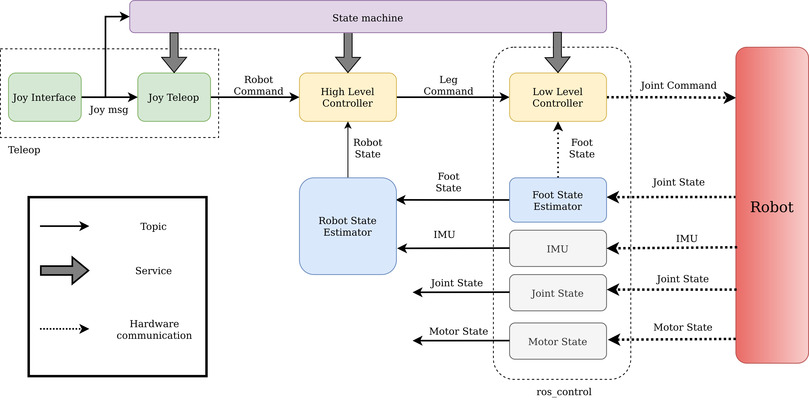
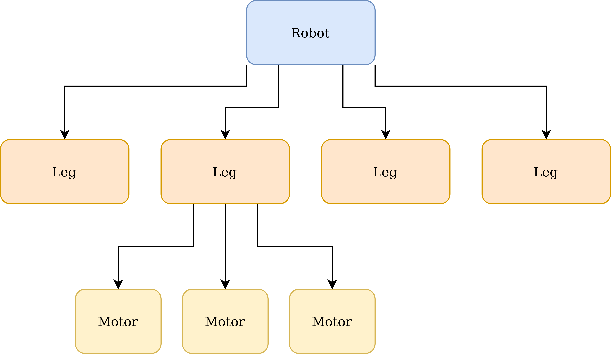
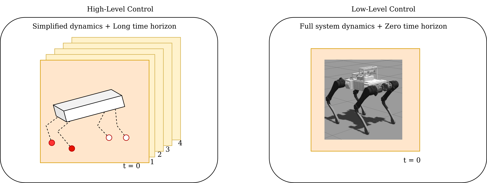
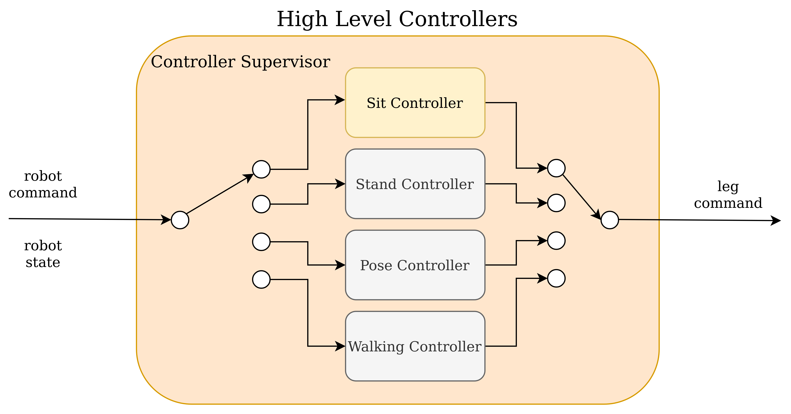
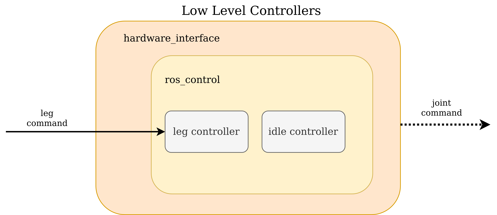

# Controller Architecture
The controller architecture for quadruped robots, specifically as applied for the Stoch 3 robot, is detailed in this document. 

## Overview
The software system architecture as used to implement the controllers for the Stoch 3 robot is shown in the diagram below:

As shown, the control system for the robot consists of the following sub-systems:

- Robot command
- High level controller (HLC)
- Low level controller (LLC)
- Robot state estimator
- Foot state estimator
- State machine

This architecture follows the hierarchical ordering that `joints` are put together to build `legs` and these are in turn put together to build the `robot`. The flow of information (or commands) also follows this hierarchy. The `robot command` is resolved into `leg commands` which are further resolved into `joint commands` by the different controllers. Similarly the `joint state` information is used to determine the `leg state`, and the `leg state` information along with other sensor information is used to determine the `robot state`.

Further to the physical hierarchichal ordering, a temporal ordering is also considered in this design. The high-level controller uses simplified models and plans the motion for longer time horizon while the low-level controller uses the full system dynamics and perform control action for a single time step. A gaphical representation is provided in the image below:

A detailed description of the each of the subsystems is provided below.

### Robot command
The `robot command` node sends high level commands to the robot such as the body velocity commands (for walking controllers) and body pose commands (for pose controllers). In a teleoperation setting the `robot command` node accepts inputs from a joystick device and forwards the commands to the controllers. In an autonomous operation setting, the commands to the robot are provided by higher level planners such as a navigation stack. The `robot command` is sent over a topic and uses a message of type [RobotCommand](../stoch3_msgs/msg/RobotCommand.msg)

### High-level controller (HLC)
The high-level controller acts on the abstract idea that a quadruped robot consists of a body (with mass and inertia) and four legs (which are assumed massless). These controllers generally do not know the specific details of the leg architecture and other leg parameters such as the mass, link lengths etc. Controllers that define behaviours for the entire robot fall into this category. Some example controllers are the sit controller, stand controller, body pose controller, walking controller and the MPC (model predictive control) based walking controller. These controllers plan the motion of the robot for a longer time horizon. 

These controllers are typically run at a lower control rate which can vary between 50 - 100 Hz. Some of the controllers in this set are also very computationally intensive (such as the MPC), hence they must be run on more powerful onboard computers (e.g. Intel NUC, Nvidia Xavier). Multiple controllers are implemented to define different behaiour of the robot. Depending on the choice of benaviour the specific controller is kept active. To ensure seamless switching between controllers, which is required to achieve seamless transition of behaviours, and to enforce mutually exclusive operation (i.e., only one controller is active at any given time) all the controllers are managed by a `controller supervisor`. 

The `controller supervisor` subscribes to the inputs: `robot command` and `robot state` and provides them to the active controller to obtain the `leg command`. It then publishes the `leg command` to be used by the low level controllers. Switching between different controllers is done by making a service call to the `controller supervisor`. 

### Low-level controller (LLC)
The low-level controllers work on the abstaction of the legs. They convert the leg commands to the joint commands. Details pertaining to the architecture of the legs, inertial parameters and  kinematic parameters are used by these controllers. The low-level controllers can also work on the abstraction of the robot as a whole, however, the differentiating factor between the low-level and high-level controllers is the time horizon for planning. The low-level controllers do not work on a planning horizon, they apply control actions only for next time-step.

The low-level controllers are operated at higher frequencies ranging between 200 - 1000 Hz. Simple controllers running at lower frequencies can be run on low-cost computational hardware such as the Raspberry Pi. The low-level controllers receive leg commands and provide the individual joint commands after taking into consideration the kinematics, statics and dynamics of the legs (and also the robot). 

The low-level controllers are implemented in the ros_control framework. This is done to enable the use of the same controllers within the actual hardware and also the simulation environment.
A hardware_interface is implemented to talk to the actual robot hardware. The ros_control framework runs within the hardware_interface. Different interfaces are provided for the actual hardware and the simulation environment, while the same ros_control code runs within both the interfaces. 

Along with the controllers, the foot state estimator is also implemented within the ros_control framework. Multiple controllers are run within the framework and they are switched (or activated) depending on the desired functionality. The state machine triggers the controller_manager to start/stop the controllers as required. 

### Robot state estimator
The robot state estimator implements a Kalman filter to obtain an estimate of the robot state. It uses information from the inertial measurement unit (IMU) and the foot state estimator to determine the robots position, velocity, orientation and position of the feet with regards to a gobal frame of reference.

### Foot state estimator
The foot state estimator provides information regarding the position and velocity of the feet and also the force exerted by the feet on the environment. Furthermore the state of foot contact is also estimated and provided by the foot state estimator. 

The foot state estimator is implemented within the ros_control framework alongside the low level controllers. 

### State machine
The state machine, as the name suggests, manages the state of software nodes of the robot. The robot can be in one of multiple states as given time depending on the desired behaviour. The state machine ensures that the correct high-level controllers and low-level controllers are active to achieve the desired behaviour. See the documentation on the [state machine](state_machine.md) for more details.
