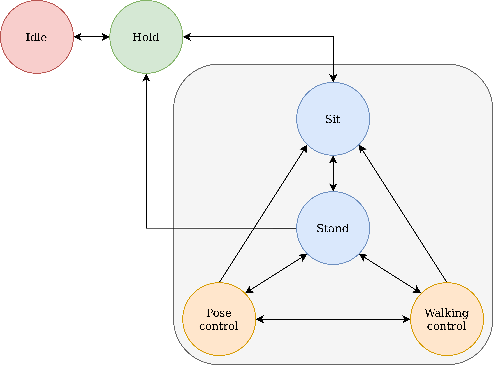

# State Machine
The robot is controlled by a state-machine that has the following states: 

| State | Description |
|:--- | :--- |
| **Idle** | Motors powered off. |
| **Hold** | Motors powered up; holds the current position of the motors. |
| **Sit** | Moves to a sit position from the current position.
| **Stand** | Moves to a stand position from the current position. |
| **WalkingControl** | Enables the walking controller; activates the joystick axes for moving the robot forward/backward, sideways, and turning. |
| **PoseControl** | Moves the torso while standing in place; activates the joystick axes to control up-down motion of the torso along with roll and pitch. |

The state-machine is implemented in the `stoch3_state_machine` package. On power-up the robot will start in the `Idle` state. The transitions between the states are shown below:

The buttons on the Logitech F710 wireless joystick that correspond to the states are:

| State | Button |
| :--- | :--- |
| Idle | Back (<)|
| Hold | Start (>)|
| Sit | X |
| Stand | Y |
| PoseControl | A |
| WalkingControl | B |

When the robot is in the `WalkingControl` state, the left joystick axes are used to move forward/backward (vertical axis) and turn (horizontal axis) while the right joystick axes are used to move sideways (horizontal axis).

When in the `PoseControl` state, the left joystick axes are used to roll (horizontal axis) and pitch (vertical axis) the robot body while the right joystick axes are used to move the body upward/downward (vertical axis). 

### State-machine operation:
Each state in the state machine has three sub-states:

- Init
- Run
- Exit

The instructions in the `init` sub-state are executed once when the state is first entered. Immediately after the `init` sub-state is executed the `run` sub-state is executed once (on entry into the state). Subsequently when the state machine is triggered, the `run` sub-state is executed. On a call to exit the state the `exit` sub-state is executed. 

The `init` sub-state can be used for *setup* (initialization) and the `exit` sub-state can be used for *cleanup*.
 
